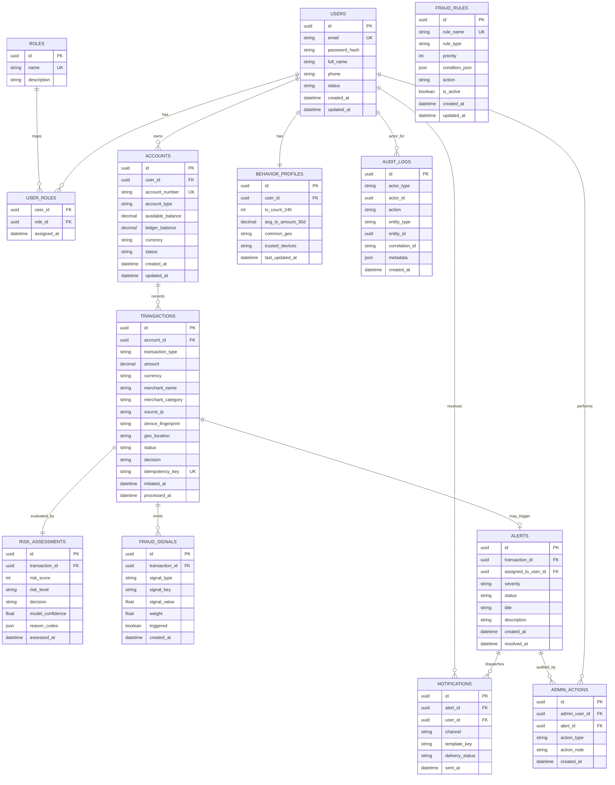

# ER Diagram - FinGuard AI

## Database Schema Overview
This schema supports user/account/transaction lifecycle, fraud and risk decisions, alerts, notifications, and immutable audit logging.

## Key Tables
- `users`: identity, profile, status.
- `roles`, `user_roles`: RBAC model.
- `accounts`: financial account state.
- `transactions`: payment events and outcomes.
- `risk_assessments`: detailed score and decision metadata.
- `fraud_signals`: rule/model signal breakdown.
- `behavior_profiles`: rolling user behavior baseline.
- `alerts`: risk/fraud alert lifecycle.
- `notifications`: channel delivery status.
- `audit_logs`: immutable activity trail.
- `fraud_rules`: configurable rule engine policies.
- `admin_actions`: overrides and rule changes by analysts/admins.

## Constraints and Data Rules
- Unique: `users.email`, `accounts.account_number`, `transactions.idempotency_key`.
- FK constraints enforced with indexed references.
- `transactions.amount > 0` check constraint.
- Enum-like constraints for statuses (`PENDING`, `APPROVED`, `BLOCKED`, etc.).
- `audit_logs` append-only policy.
- Soft delete (`deleted_at`) only for non-financial metadata tables.

## Mermaid ER Diagram

## Indexing Recommendations
- `transactions(account_id, initiated_at desc)`
- `transactions(status, decision, processed_at desc)`
- `risk_assessments(risk_score desc, assessed_at desc)`
- `alerts(status, severity, created_at desc)`
- `audit_logs(correlation_id)`
- `fraud_signals(transaction_id, triggered)`

## Retention and Compliance
- Audit logs: retain per regulatory policy (e.g., 7 years).
- Transaction and risk data: archival policy with immutable snapshots.
- PII minimization in logs (hash/mask sensitive fields).
