# Class Diagram - FinGuard AI

## TypeScript-Oriented Design Notes
- Domain entities and service contracts use strict TypeScript typing.
- Repository and strategy behaviors are interface-driven.
- DTO classes define request/response contracts at API boundaries.
- NestJS dependency injection binds interfaces to Prisma-backed implementations.

## OOP Relationship Notes
- Inheritance: entities inherit from `BaseEntity` and API helpers from `BaseController`.
- Composition: services compose repositories, strategies, and domain services.
- Aggregation: `User` aggregates multiple `Account` objects.
- Polymorphism: risk strategies and notification channels are runtime-swappable.

## Mermaid Class Diagram

```mermaid
classDiagram
    direction LR

    class BaseEntity {
      +id: string
      +createdAt: Date
      +updatedAt: Date
    }

    class User {
      +email: string
      +phone: string
      +status: UserStatus
      +register(): void
      +lock(): void
    }

    class Account {
      +userId: string
      +accountNumber: string
      +availableBalance: number
      +currency: Currency
      +status: AccountStatus
      +credit(amount: number): void
      +debit(amount: number): void
      +freeze(): void
    }

    class Transaction {
      +accountId: string
      +amount: number
      +currency: Currency
      +status: TransactionStatus
      +decision: RiskDecision
      +markApproved(): void
      +markBlocked(): void
    }

    class RiskAssessment {
      +transactionId: string
      +riskScore: number
      +riskLevel: RiskLevel
      +reasonCodes: string[]
      +modelConfidence: number
    }

    class Alert {
      +transactionId: string
      +severity: AlertSeverity
      +status: AlertStatus
      +assign(analystId: string): void
      +resolve(note: string): void
    }

    BaseEntity <|-- User
    BaseEntity <|-- Account
    BaseEntity <|-- Transaction
    BaseEntity <|-- RiskAssessment
    BaseEntity <|-- Alert

    class BaseController {
      +ok~T~(data: T): ApiResponse~T~
      +created~T~(data: T): ApiResponse~T~
      +handleError(error: Error): never
    }

    class AuthController {
      +login(dto: LoginDto): Promise~AuthResponseDto~
      +refresh(dto: RefreshTokenDto): Promise~AuthResponseDto~
    }

    class TransactionController {
      +createTransaction(dto: CreateTransactionDto): Promise~TransactionResponseDto~
      +getTransaction(transactionId: string): Promise~TransactionResponseDto~
    }

    BaseController <|-- AuthController
    BaseController <|-- TransactionController

    class LoginDto {
      +email: string
      +password: string
    }

    class CreateTransactionDto {
      +accountId: string
      +amount: number
      +currency: Currency
      +merchantName: string
      +idempotencyKey: string
    }

    class TransactionResponseDto {
      +transactionId: string
      +status: TransactionStatus
      +decision: RiskDecision
      +riskScore: number
      +correlationId: string
    }

    class IAuthService {
      <<interface>>
      +login(dto: LoginDto): Promise~AuthResponseDto~
      +refresh(token: string): Promise~AuthResponseDto~
    }

    class ITransactionService {
      <<interface>>
      +createTransaction(dto: CreateTransactionDto, userId: string): Promise~TransactionResponseDto~
    }

    class IFraudDetectionService {
      <<interface>>
      +runDetection(context: TransactionContext): Promise~FraudSignalSet~
    }

    class IRiskModelStrategy {
      <<interface>>
      +score(input: RiskInput): Promise~RiskScoreResult~
    }

    class INotificationChannel {
      <<interface>>
      +send(message: NotificationMessage): Promise~void~
    }

    class IUserRepository {
      <<interface>>
      +findById(id: string): Promise~User|null~
      +findByEmail(email: string): Promise~User|null~
      +save(user: User): Promise~User~
    }

    class IAccountRepository {
      <<interface>>
      +findById(id: string): Promise~Account|null~
      +save(account: Account): Promise~Account~
    }

    class ITransactionRepository {
      <<interface>>
      +findById(id: string): Promise~Transaction|null~
      +save(tx: Transaction): Promise~Transaction~
    }

    class TransactionService {
      +createTransaction(dto: CreateTransactionDto, userId: string): Promise~TransactionResponseDto~
      +evaluateAndPersist(context: TransactionContext): Promise~Transaction~
    }

    class FraudDetectionService {
      +runDetection(context: TransactionContext): Promise~FraudSignalSet~
    }

    class RiskScoringService {
      +calculateRiskScore(input: RiskInput): Promise~RiskScoreResult~
    }

    class RiskModelFactory {
      +getStrategy(context: TransactionContext): IRiskModelStrategy
    }

    class RuleOnlyStrategy {
      +score(input: RiskInput): Promise~RiskScoreResult~
    }

    class HybridAiStrategy {
      +score(input: RiskInput): Promise~RiskScoreResult~
    }

    class HighValueTxStrategy {
      +score(input: RiskInput): Promise~RiskScoreResult~
    }

    class AlertService {
      +createAlert(event: TransactionDecidedEvent): Promise~Alert~
      +updateAlertStatus(alertId: string, status: AlertStatus): Promise~Alert~
    }

    class PrismaUserRepository
    class PrismaAccountRepository
    class PrismaTransactionRepository
    class PrismaAlertRepository

    class EmailNotifier
    class SmsNotifier
    class InAppNotifier

    class ConfigService {
      <<singleton>>
      +get(key: string): string
    }

    AuthController --> IAuthService
    TransactionController --> ITransactionService

    TransactionController --> CreateTransactionDto
    AuthController --> LoginDto
    TransactionController --> TransactionResponseDto

    ITransactionService <|.. TransactionService
    IFraudDetectionService <|.. FraudDetectionService

    IUserRepository <|.. PrismaUserRepository
    IAccountRepository <|.. PrismaAccountRepository
    ITransactionRepository <|.. PrismaTransactionRepository

    IRiskModelStrategy <|.. RuleOnlyStrategy
    IRiskModelStrategy <|.. HybridAiStrategy
    IRiskModelStrategy <|.. HighValueTxStrategy

    INotificationChannel <|.. EmailNotifier
    INotificationChannel <|.. SmsNotifier
    INotificationChannel <|.. InAppNotifier

    TransactionService --> IAccountRepository
    TransactionService --> ITransactionRepository
    TransactionService --> IFraudDetectionService
    TransactionService --> RiskScoringService

    FraudDetectionService --> RiskModelFactory
    RiskScoringService --> IRiskModelStrategy

    AlertService --> PrismaAlertRepository
    AlertService --> INotificationChannel

    User "1" o-- "1..*" Account : owns
    Account "1" o-- "0..*" Transaction : records
    Transaction "1" --> "0..1" Alert : triggers
```

## NestJS Binding Example
- `providers: [{ provide: 'ITransactionRepository', useClass: PrismaTransactionRepository }]`
- `providers: [{ provide: 'IRiskModelStrategy', useClass: HybridAiStrategy }]`
