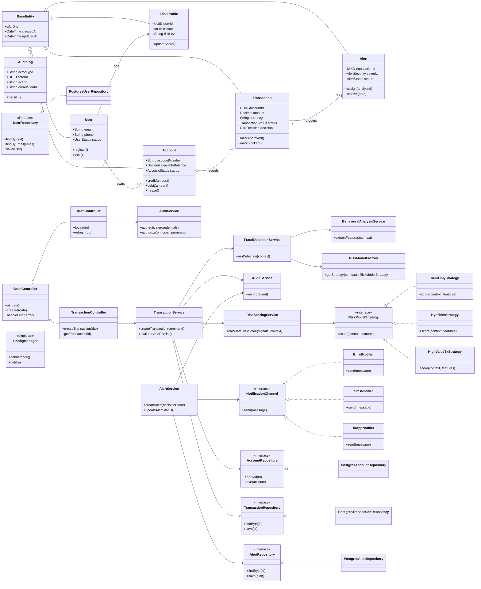

# Class Diagram - FinGuard AI

## Major Classes and Interfaces
- API Layer: controllers and DTO mapping.
- Application Layer: services, factories, strategies.
- Domain Layer: entities, value objects, contracts.
- Infrastructure Layer: repository implementations and provider adapters.

## OOP Relationship Notes
- **Inheritance**: controllers/entities extend base classes.
- **Composition**: services compose repositories and strategy contracts.
- **Aggregation**: `User` aggregates multiple `Account`s.
- **Polymorphism**: strategy interfaces support multiple concrete algorithms.

## Mermaid Class Diagram

