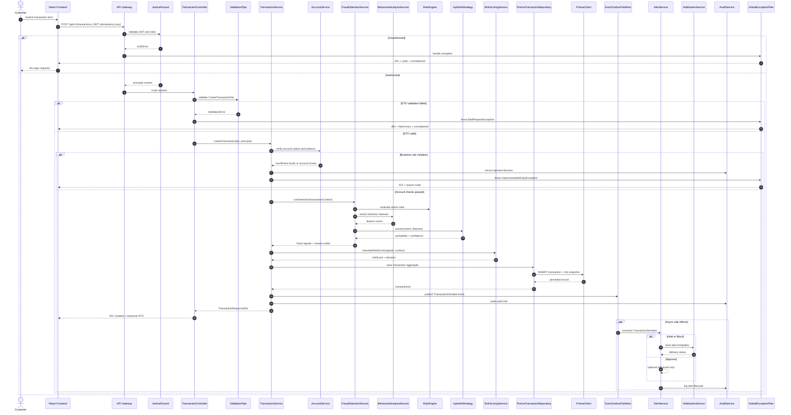
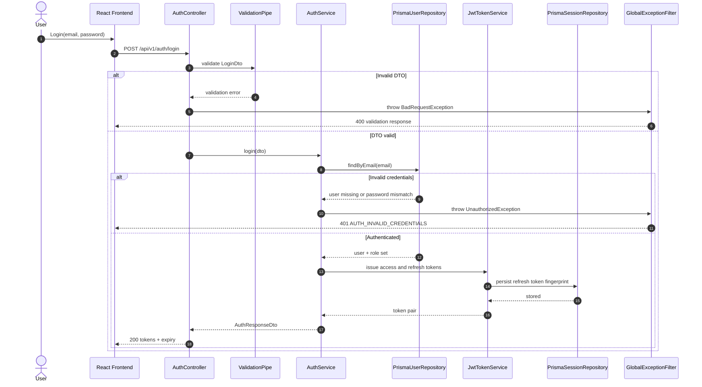
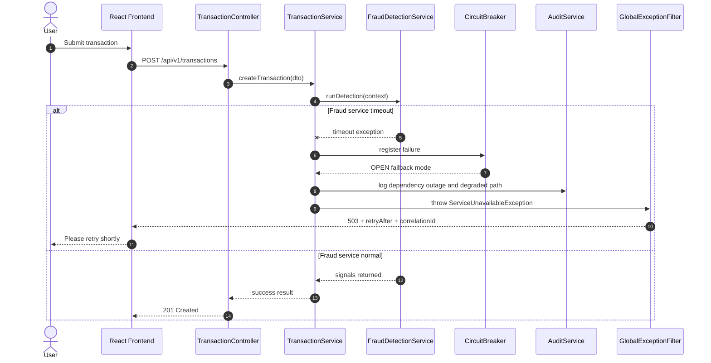

# Sequence Diagrams - FinGuard AI

## 1) End-to-End Transaction Flow (NestJS + Prisma + Risk Pipeline)

```mermaid
sequenceDiagram
    autonumber
    actor User as Customer
    participant FE as React Frontend
    participant API as API Gateway
    participant Guard as JwtAuthGuard
    participant TxC as TransactionController
    participant Pipe as ValidationPipe
    participant TxS as TransactionService
    participant AcctS as AccountService
    participant FraudS as FraudDetectionService
    participant BehavS as BehavioralAnalysisService
    participant Rule as RuleEngine
    participant AiStr as HybridAiStrategy
    participant RiskS as RiskScoringService
    participant TxRepo as PrismaTransactionRepository
    participant Prisma as PrismaClient
    participant Outbox as EventOutboxPublisher
    participant AlertS as AlertService
    participant NotifS as NotificationService
    participant AuditS as AuditService
    participant Filter as GlobalExceptionFilter

    User->>FE: Submit transaction form
    FE->>API: POST /api/v1/transactions (JWT, idempotency-key)
    API->>Guard: Validate JWT and roles

    alt Unauthorized
        Guard-->>API: AuthError
        API->>Filter: handle exception
        Filter-->>FE: 401 + code + correlationId
        FE-->>User: Re-login required
    else Authorized
        Guard-->>API: principal context
        API->>TxC: route request
        TxC->>Pipe: validate CreateTransactionDto

        alt DTO validation failed
            Pipe-->>TxC: ValidationError
            TxC->>Filter: throw BadRequestException
            Filter-->>FE: 400 + field errors + correlationId
        else DTO valid
            TxC->>TxS: createTransaction(dto, principal)
            TxS->>AcctS: verify account status and balance

            alt Business rule violation
                AcctS-->>TxS: insufficient funds or account frozen
                TxS->>AuditS: record rejected decision
                TxS->>Filter: throw UnprocessableEntityException
                Filter-->>FE: 422 + reason code
            else Account checks passed
                TxS->>FraudS: runDetection(transactionContext)
                FraudS->>Rule: evaluate active rules
                FraudS->>BehavS: extract behavior features
                BehavS-->>FraudS: feature vector
                FraudS->>AiStr: score(context, features)
                AiStr-->>FraudS: probability + confidence
                FraudS-->>TxS: fraud signals + reason codes

                TxS->>RiskS: calculateRiskScore(signals, context)
                RiskS-->>TxS: riskScore + decision

                TxS->>TxRepo: save transaction aggregate
                TxRepo->>Prisma: INSERT transaction + risk snapshot
                Prisma-->>TxRepo: persisted record
                TxRepo-->>TxS: transactionId

                TxS->>Outbox: publish TransactionDecided event
                TxS->>AuditS: write audit trail
                TxS-->>TxC: TransactionResponseDto
                TxC-->>FE: 201 Created + response DTO

                par Async side effects
                    Outbox->>AlertS: consume TransactionDecided
                    alt Hold or Block
                        AlertS->>NotifS: send alert templates
                        NotifS-->>AlertS: delivery status
                    else Approve
                        AlertS-->>AlertS: optional info event only
                    end
                    AlertS->>AuditS: log alert lifecycle
                end
            end
        end
    end
```

## 2) Authentication and Authorization Flow (JWT)

```mermaid
sequenceDiagram
    autonumber
    actor U as User
    participant FE as React Frontend
    participant AuthC as AuthController
    participant Pipe as ValidationPipe
    participant AuthS as AuthService
    participant UserRepo as PrismaUserRepository
    participant TokenS as JwtTokenService
    participant SessionRepo as PrismaSessionRepository
    participant Filter as GlobalExceptionFilter

    U->>FE: Login(email, password)
    FE->>AuthC: POST /api/v1/auth/login
    AuthC->>Pipe: validate LoginDto

    alt Invalid DTO
        Pipe-->>AuthC: validation error
        AuthC->>Filter: throw BadRequestException
        Filter-->>FE: 400 validation response
    else DTO valid
        AuthC->>AuthS: login(dto)
        AuthS->>UserRepo: findByEmail(email)

        alt Invalid credentials
            UserRepo-->>AuthS: user missing or password mismatch
            AuthS->>Filter: throw UnauthorizedException
            Filter-->>FE: 401 AUTH_INVALID_CREDENTIALS
        else Authenticated
            UserRepo-->>AuthS: user + role set
            AuthS->>TokenS: issue access and refresh tokens
            TokenS->>SessionRepo: persist refresh token fingerprint
            SessionRepo-->>TokenS: stored
            TokenS-->>AuthS: token pair
            AuthS-->>AuthC: AuthResponseDto
            AuthC-->>FE: 200 tokens + expiry
        end
    end
```

## 3) Error Handling and Recovery Flow

```mermaid
sequenceDiagram
    autonumber
    actor U as User
    participant FE as React Frontend
    participant TxC as TransactionController
    participant TxS as TransactionService
    participant FraudS as FraudDetectionService
    participant CB as CircuitBreaker
    participant AuditS as AuditService
    participant Filter as GlobalExceptionFilter

    U->>FE: Submit transaction
    FE->>TxC: POST /api/v1/transactions
    TxC->>TxS: createTransaction(dto)
    TxS->>FraudS: runDetection(context)

    alt Fraud service timeout
        FraudS--xTxS: timeout exception
        TxS->>CB: register failure
        CB-->>TxS: OPEN fallback mode
        TxS->>AuditS: log dependency outage and degraded path
        TxS->>Filter: throw ServiceUnavailableException
        Filter-->>FE: 503 + retryAfter + correlationId
        FE-->>U: Please retry shortly
    else Fraud service normal
        FraudS-->>TxS: signals returned
        TxS-->>TxC: success result
        TxC-->>FE: 201 Created
    end
```
