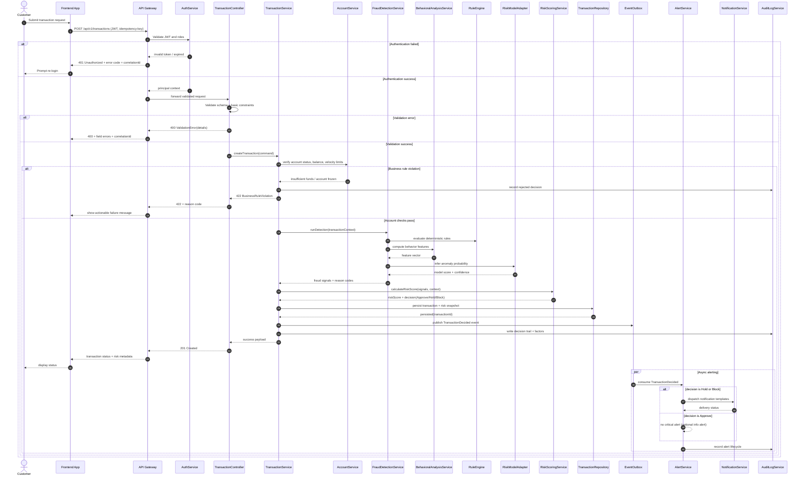
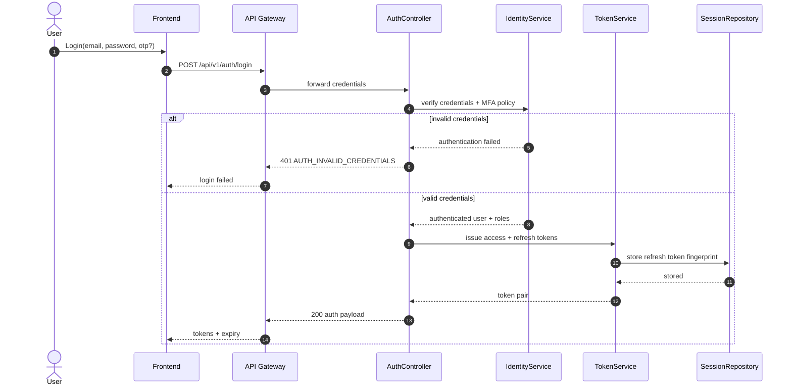
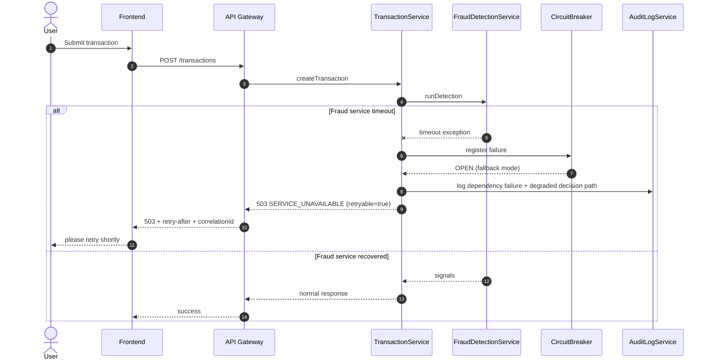

# Sequence Diagrams - FinGuard AI

## 1) End-to-End Transaction + Fraud + Risk + Alert Flow

## 2) Authentication and Authorization Flow

## 3) Error Handling and Recovery Flow (Service Failure)

