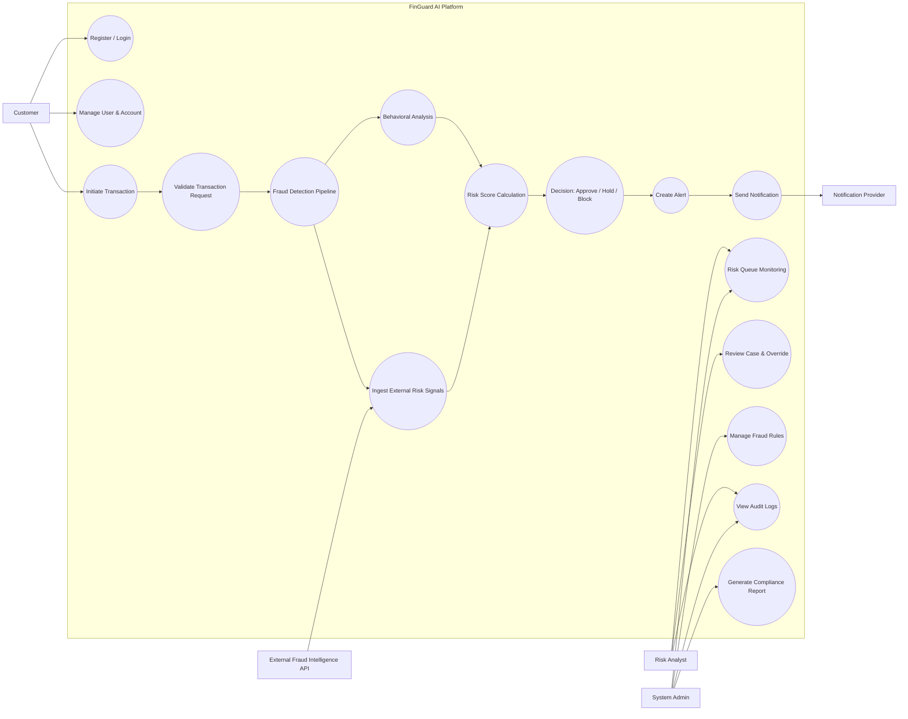

# Use Case Diagram - FinGuard AI

## Actors
- Customer
- Risk Analyst
- System Admin
- Notification Provider (Email/SMS Gateway)
- External Fraud Intelligence API (optional external signal source)

## Core Use Cases
- Register/Login/Refresh Session
- Manage Profile and Linked Accounts
- Initiate Transaction
- Run Transaction Validation
- Execute Fraud Detection (Rules + AI)
- Compute Risk Score
- Approve/Block/Review Transaction
- Generate Alerts and Notify Users
- Admin Risk Queue Monitoring
- Manage Rules and Thresholds
- Manual Case Review and Override
- View Audit Logs and Compliance Reports

## Mermaid Use Case Diagram

## Notes
- `Initiate Transaction` includes validation, fraud analysis, and risk scoring before decisioning.
- `Review Case & Override` is restricted by RBAC and fully audit-logged.
- `Send Notification` is asynchronous after decision/alert creation.
